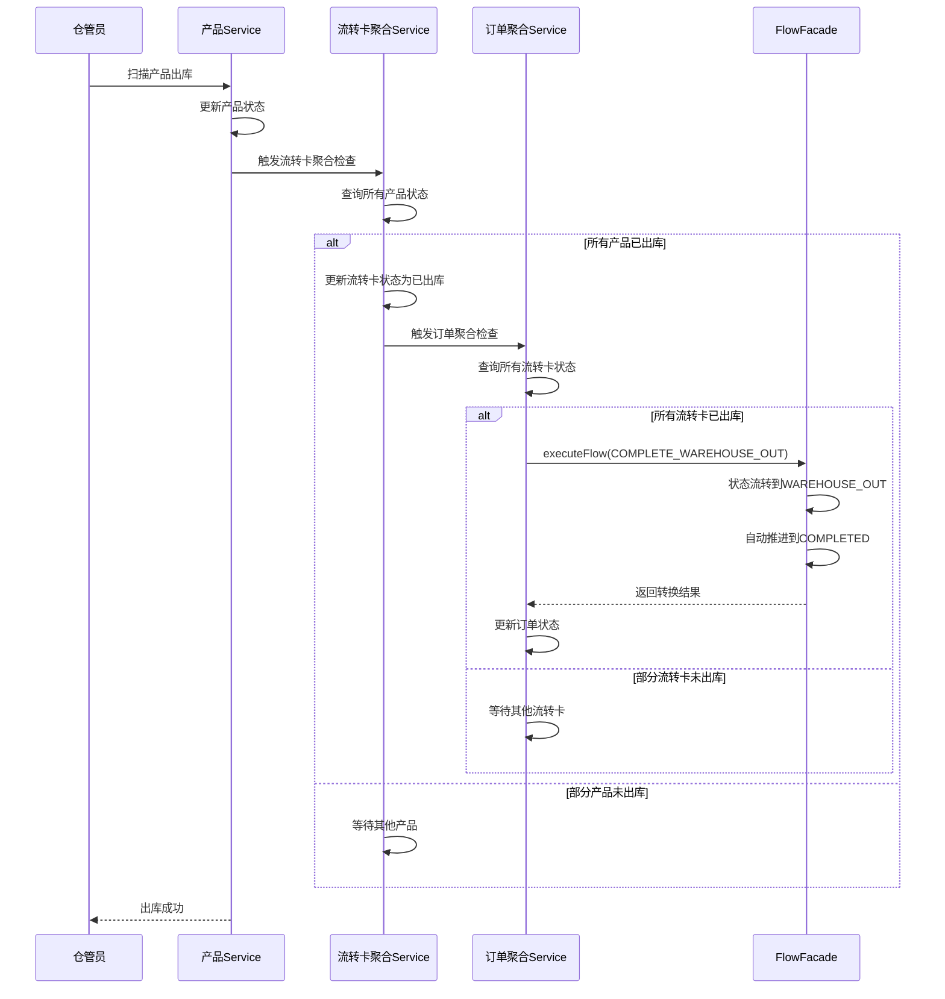

# 出库功能实施计划

## 文档信息

| 项目 | 说明 |
|------|------|
| 文档标题 | 产品出库功能与三层聚合状态同步实施计划 |
| 创建日期 | 2026-06-09 |
| 负责人 | 待定 |
| 当前版本 | v1.0 |
| 文档状态 | 草案 |

---

## 一、需求背景

### 1.1 业务现状

当前系统的仓储流程在"入库完成"后直接自动流转到"已完成"状态，缺少出库环节的管理和追踪。

**现有流程**：
```
入库完成 (WAREHOUSED) → 自动推进 → 已完成 (COMPLETED)
```

**存在问题**：
- 无法追踪产品的实际出库情况
- 仓管员没有出库操作记录
- 订单完成时间与实际交付时间存在偏差
- 缺少出库环节的审计追踪

### 1.2 需求目标

在入库完成与订单完成之间增加出库管理环节，实现：
1. **产品级别出库管理**：每个产品独立记录出库状态
2. **三层聚合同步**：产品 → 流转卡 → 订单的自动状态同步
3. **自动完成订单**：所有流转卡出库后订单自动完成

### 1.3 核心特性

**三层数据模型**：
```
订单 (1)
  └─ 流转卡 (N)
       └─ 产品 (N)
```

**三层聚合逻辑**：
- 流转卡下所有质检合格产品都出库 → 流转卡状态变为已出库
- 订单下所有流转卡都已出库 → 订单状态变为已出库并自动完成

**过渡状态设计**：
- `WAREHOUSE_OUT(6030)` 在订单层面是过渡状态，不停留
- 订单到达已出库后立即自动推进到已完成

---

## 二、总体设计

### 2.1 架构设计

```
┌─────────────────────────────────────────────────────────┐
│                     前端操作层                           │
│  仓管员扫描产品/流转卡二维码 → 调用出库接口              │
└─────────────────┬───────────────────────────────────────┘
                  │
┌─────────────────▼───────────────────────────────────────┐
│                 生产模块 (Production)                     │
│  - ProductionProductService.warehouseOut()               │
│  - ProductionProductService.warehouseOutByRecord()       │
│  - ProductionRecordAggregateService                      │
└─────────────────┬───────────────────────────────────────┘
                  │
┌─────────────────▼───────────────────────────────────────┐
│                 订单模块 (Order)                          │
│  - OrderFlowSyncService.checkAndUpdateOrder...()         │
└─────────────────┬───────────────────────────────────────┘
                  │
┌─────────────────▼───────────────────────────────────────┐
│                  流程模块 (Flow)                          │
│  - FlowFacade.executeFlow(COMPLETE_WAREHOUSE_OUT)        │
│  - 自动推进到 COMPLETED                                   │
└─────────────────────────────────────────────────────────┘
```

### 2.2 状态流转设计

**修改后的完整流程**：
```
WAREHOUSE_IN(6010)
  ↓ COMPLETE_WAREHOUSE_IN
WAREHOUSED(6020)
  ↓ 所有产品出库（三层聚合触发）
WAREHOUSE_OUT(6030) ← 过渡状态
  ↓ 自动推进
COMPLETED(8010) ✓
```

### 2.3 关键技术点

**① 三层聚合触发链**：
- 产品出库 → 触发流转卡聚合检查
- 流转卡状态更新 → 触发订单聚合检查
- 订单状态更新 → 自动推进到完成

**② 聚合判断规则**：
- 流转卡：只统计质检合格（qcResult='pass'）的产品
- 订单：统计所有流转卡的状态

**③ 幂等性保障**：
- 产品级别：检查 `isWarehouseOut` 标志位
- 聚合检查：每次触发都重新查询最新状态

**④ 事务边界**：
- 产品出库 + 流转卡聚合：同一事务
- 流转卡更新 + 订单聚合：同一事务

---

## 三、详细实施步骤

### 3.1 阶段一：数据库改动

#### 3.1.1 production_product 表新增字段

**DDL**：
```sql
ALTER TABLE production_product 
ADD COLUMN is_warehouse_out TINYINT DEFAULT 0 
    COMMENT '是否已出库（0=否，1=是）' AFTER qc_user_id,
ADD COLUMN warehouse_out_time DATETIME DEFAULT NULL 
    COMMENT '出库时间' AFTER is_warehouse_out,
ADD COLUMN warehouse_out_operator_id BIGINT DEFAULT NULL 
    COMMENT '出库操作员ID' AFTER warehouse_out_time,
ADD COLUMN warehouse_out_operator_name VARCHAR(50) DEFAULT NULL 
    COMMENT '出库操作员姓名' AFTER warehouse_out_operator_id;
```

**索引**：
```sql
ALTER TABLE production_product 
ADD INDEX idx_production_product_warehouse_out (production_record_id, is_warehouse_out);
```

**回滚方案**：
```sql
ALTER TABLE production_product 
DROP COLUMN is_warehouse_out,
DROP COLUMN warehouse_out_time,
DROP COLUMN warehouse_out_operator_id,
DROP COLUMN warehouse_out_operator_name,
DROP INDEX idx_production_product_warehouse_out;
```

**影响范围**：
- 表：`production_product`
- 数据量：预估 10万+ 行
- 执行时间：< 5秒（新增字段，无数据迁移）
- 锁表影响：极小（MySQL 8.0 支持 INSTANT ADD COLUMN）

#### 3.1.2 DDL 更新到 ddl.sql

**文件位置**：`sql/ddl.sql`

**修改内容**：在 `production_product` 表定义中添加新字段。

---

### 3.2 阶段二：Flow 模块改动

#### 3.2.1 FlowStatusEnum 新增状态

**文件**：`yigongbao-module-flow/src/main/java/com/yigongbao/flow/enums/FlowStatusEnum.java`

```java
// 在 WAREHOUSED(6020) 后添加
/**
 * 已出库（过渡状态，自动推进到已完成）
 */
WAREHOUSE_OUT(6030, "已出库"),
```

#### 3.2.2 FlowActionEnum 新增动作

**文件**：`yigongbao-module-flow/src/main/java/com/yigongbao/flow/enums/FlowActionEnum.java`

```java
// 在仓储阶段动作部分添加
/**
 * 完成出库（所有流转卡出库后由系统触发）
 */
COMPLETE_WAREHOUSE_OUT("COMPLETE_WAREHOUSE_OUT", "完成出库"),
```

#### 3.2.3 FlowPhaseTransitionRules 修改阶段推进规则

**文件**：`yigongbao-module-flow/src/main/java/com/yigongbao/flow/rules/FlowPhaseTransitionRules.java`

**修改点1**：`decideNextPhaseAndStatus()` 方法

```java
// 修改 WAREHOUSED 的推进逻辑（约第194行）
// 原代码：
// if (targetStatus == FlowStatusEnum.WAREHOUSED) {
//     return new PhaseAndStatus(FlowPhaseEnum.COMPLETED, FlowStatusEnum.COMPLETED);
// }

// 修改为：
if (targetStatus == FlowStatusEnum.WAREHOUSED) {
    return new PhaseAndStatus(null, null); // 不自动推进，等待出库
}

// 新增 WAREHOUSE_OUT 的推进逻辑（约第200行之后）
// 已出库 → 进入已完成
if (targetStatus == FlowStatusEnum.WAREHOUSE_OUT) {
    return new PhaseAndStatus(FlowPhaseEnum.COMPLETED, FlowStatusEnum.COMPLETED);
}
```

**修改点2**：`isPhaseChangeAction()` 方法

```java
// 在 switch 中添加 COMPLETE_WAREHOUSE_OUT（约第236行）
public static boolean isPhaseChangeAction(FlowActionEnum action) {
    return switch (action) {
        case DATA_AUDIT_PASS, DOWNLOAD_DATA_PACKAGE, COMPLETE_PRINT,
             COMPLETE_POST_PROCESSING, QC_PASS, REWORK_COMPLETE,
             COMPLETE_WAREHOUSE_IN, COMPLETE_WAREHOUSE_OUT, // 新增
             REWORK_TO_PRINT -> true;
        default -> false;
    };
}
```

#### 3.2.4 FlowStatusTransitionRules 修改状态转换规则

**文件**：`yigongbao-module-flow/src/main/java/com/yigongbao/flow/rules/FlowStatusTransitionRules.java`

**修改点1**：`STATUS_TRANSITIONS` 静态块（约第97-103行）

```java
// 修改仓储阶段状态转换
// 原代码：
// transitions.put(statusKey(FlowPhaseEnum.WAREHOUSE, FlowStatusEnum.WAREHOUSED),
//         Set.of(FlowStatusEnum.COMPLETED));

// 修改为：
transitions.put(statusKey(FlowPhaseEnum.WAREHOUSE, FlowStatusEnum.WAREHOUSED),
        Set.of(FlowStatusEnum.WAREHOUSE_OUT)); // 只能到已出库

// 新增：
transitions.put(statusKey(FlowPhaseEnum.WAREHOUSE, FlowStatusEnum.WAREHOUSE_OUT),
        Set.of(FlowStatusEnum.COMPLETED)); // 已出库到已完成
```

**修改点2**：`getTargetStatus()` 方法（约第258行）

```java
// 在仓储阶段动作部分添加
case COMPLETE_WAREHOUSE_OUT -> FlowStatusEnum.WAREHOUSE_OUT.getValue();
```

**修改点3**：`getAvailableActions()` 方法（约第173-178行）

```java
// 修改 WAREHOUSE 阶段的逻辑
case WAREHOUSE -> switch (status) {
    case WAREHOUSE_IN -> needsProduction
            ? List.of(FlowActionEnum.COMPLETE_WAREHOUSE_IN)
            : List.of();
    // WAREHOUSED 状态不返回动作，等待系统自动聚合触发
    case WAREHOUSED -> List.of();
    // WAREHOUSE_OUT 是过渡状态，不会出现在订单查询中
    default -> List.of();
};
```

---

### 3.3 阶段三：生产模块改动

#### 3.3.1 ProductionProductEntity 新增字段

**文件**：`yigongbao-module-production/src/main/java/com/yigongbao/module/production/product/entity/ProductionProductEntity.java`

```java
/** 是否已出库（0=否，1=是） */
private Integer isWarehouseOut;

/** 出库时间 */
private LocalDateTime warehouseOutTime;

/** 出库操作员ID */
private Long warehouseOutOperatorId;

/** 出库操作员姓名 */
private String warehouseOutOperatorName;
```

#### 3.3.2 ProductionProductService 新增方法

**文件**：`yigongbao-module-production/src/main/java/com/yigongbao/module/production/product/service/ProductionProductService.java`

```java
/**
 * 产品出库
 *
 * @param productId 产品ID
 */
void warehouseOut(Long productId);

/**
 * 批量产品出库（按流转卡）
 *
 * @param recordId 流转卡ID
 */
void warehouseOutByRecord(Long recordId);
```

#### 3.3.3 ProductionProductServiceImpl 实现

**文件**：`yigongbao-module-production/src/main/java/com/yigongbao/module/production/product/service/impl/ProductionProductServiceImpl.java`

**关键实现点**：
1. 校验产品状态（必须是质检合格）
2. 幂等性处理（已出库则跳过）
3. 更新产品出库信息
4. 触发流转卡聚合检查

**依赖注入**：
```java
private final ProductionRecordAggregateService productionRecordAggregateService;
```

#### 3.3.4 ProductionRecordAggregateService 新增服务

**文件**：`yigongbao-module-production/src/main/java/com/yigongbao/module/production/record/service/ProductionRecordAggregateService.java`（新建）

```java
/**
 * 生产流转卡聚合服务
 * 处理流转卡级别的状态聚合逻辑
 */
public interface ProductionRecordAggregateService {
    /**
     * 检查并更新流转卡出库状态
     * 当流转卡下所有质检合格产品都已出库时，更新流转卡状态
     *
     * @param recordId 流转卡ID
     */
    void checkAndUpdateRecordWarehouseOutStatus(Long recordId);
}
```

**实现类关键逻辑**：
1. 查询流转卡及其所有产品
2. 统计质检合格产品的出库情况
3. 判断是否全部出库
4. 更新流转卡状态为 WAREHOUSE_OUT
5. 触发订单聚合检查

#### 3.3.5 ProductionProductController 新增接口

**文件**：`yigongbao-module-production/src/main/java/com/yigongbao/module/production/product/controller/ProductionProductController.java`

```java
/**
 * 产品出库
 */
@PostMapping("/warehouse-out/{productId}")
public Result<Void> warehouseOut(@PathVariable Long productId) {
    productionProductService.warehouseOut(productId);
    return Result.success();
}

/**
 * 批量产品出库（按流转卡）
 */
@PostMapping("/warehouse-out-batch/{recordId}")
public Result<Void> warehouseOutBatch(@PathVariable Long recordId) {
    productionProductService.warehouseOutByRecord(recordId);
    return Result.success();
}
```

---

### 3.4 阶段四：订单模块改动

#### 3.4.1 OrderFlowSyncService 新增方法

**文件**：`yigongbao-module-order/src/main/java/com/yigongbao/module/order/service/OrderFlowSyncService.java`

```java
/**
 * 检查并更新订单出库状态
 * 当订单下所有流转卡都已出库时，触发订单状态流转
 *
 * @param orderId 订单ID
 */
void checkAndUpdateOrderWarehouseOutStatus(Long orderId);
```

#### 3.4.2 OrderFlowSyncServiceImpl 实现

**文件**：`yigongbao-module-order/src/main/java/com/yigongbao/module/order/service/impl/OrderFlowSyncServiceImpl.java`

**关键实现点**：
1. 查询订单及其所有流转卡
2. 校验订单当前状态（必须是 WAREHOUSED）
3. 判断是否所有流转卡都是 WAREHOUSE_OUT 状态
4. 调用 FlowFacade.executeFlow(COMPLETE_WAREHOUSE_OUT)
5. 更新订单的 phase 和 status

**依赖注入**：
```java
private final ProductionRecordMapper productionRecordMapper;
private final FlowFacade flowFacade;
```

**事务控制**：
```java
@Transactional(rollbackFor = Exception.class)
```

---

### 3.5 阶段五：错误码改动

#### 3.5.1 ErrorCodeEnum 新增错误码

**文件**：`yigongbao-common/src/main/java/com/yigongbao/common/enums/ErrorCodeEnum.java`

```java
// ==================== 生产模块错误码 (800-824) ====================
// 在最后添加
PRODUCT_STATUS_NOT_ALLOW_WAREHOUSE_OUT(825, "产品当前状态不允许出库", 3),
```

**错误码说明**：
- **825**：产品未质检合格时尝试出库
- 优先级：3（中等）
- 使用场景：ProductionProductService.warehouseOut() 校验失败时抛出

---

## 四、测试方案

### 4.1 单元测试

#### 4.1.1 ProductionProductServiceImpl 测试

**测试类**：`ProductionProductServiceImplTest.java`

**测试用例**：
1. `testWarehouseOut_Success()` - 正常出库
2. `testWarehouseOut_ProductNotFound()` - 产品不存在
3. `testWarehouseOut_QcNotPass()` - 质检未通过
4. `testWarehouseOut_AlreadyOut()` - 已出库（幂等性）
5. `testWarehouseOutByRecord_Success()` - 批量出库成功
6. `testWarehouseOutByRecord_PartialQcPass()` - 部分质检合格

#### 4.1.2 ProductionRecordAggregateService 测试

**测试类**：`ProductionRecordAggregateServiceTest.java`

**测试用例**：
1. `testCheckAndUpdate_AllProductsOut()` - 所有产品出库，流转卡状态更新
2. `testCheckAndUpdate_PartialProductsOut()` - 部分产品出库，流转卡状态不变
3. `testCheckAndUpdate_OnlyPassProductsCount()` - 只统计质检合格产品
4. `testCheckAndUpdate_RecordNotWarehoused()` - 流转卡状态不是已入库

#### 4.1.3 OrderFlowSyncService 测试

**测试类**：`OrderFlowSyncServiceTest.java`

**测试用例**：
1. `testCheckAndUpdate_AllRecordsOut()` - 所有流转卡出库，订单状态更新
2. `testCheckAndUpdate_PartialRecordsOut()` - 部分流转卡出库，订单状态不变
3. `testCheckAndUpdate_OrderNotWarehoused()` - 订单状态不是已入库
4. `testCheckAndUpdate_AutoComplete()` - 验证自动推进到 COMPLETED

### 4.2 集成测试

#### 4.2.1 端到端流程测试

**测试场景1：单流转卡订单完整流程**

```
前置条件：
- 订单 O1，包含 1 个流转卡 R1
- 流转卡 R1 包含 2 个产品：P1(pass), P2(pass)
- 流转卡状态：WAREHOUSED(6020)

操作步骤：
1. 调用 /product/warehouse-out/{P1.id}
2. 调用 /product/warehouse-out/{P2.id}

预期结果：
- P1.isWarehouseOut = 1
- P2.isWarehouseOut = 1
- R1.status = WAREHOUSE_OUT(6030)
- O1.status = COMPLETED(8010)
- O1.phase = COMPLETED(80)
```

**测试场景2：多流转卡订单分步出库**

```
前置条件：
- 订单 O2，包含 2 个流转卡：R1, R2
- R1 包含 2 个产品：P1(pass), P2(pass)
- R2 包含 1 个产品：P3(pass)
- 流转卡状态：WAREHOUSED(6020)

操作步骤：
1. 调用 /product/warehouse-out-batch/{R1.id}
2. 查询订单状态
3. 调用 /product/warehouse-out/{P3.id}

预期结果：
- 步骤1后：R1.status = WAREHOUSE_OUT, O2.status = WAREHOUSED（等待R2）
- 步骤3后：R2.status = WAREHOUSE_OUT, O2.status = COMPLETED
```

**测试场景3：质检不合格产品不影响出库**

```
前置条件：
- 流转卡 R1 包含 3 个产品：P1(pass), P2(fail), P3(pass)

操作步骤：
1. 调用 /product/warehouse-out-batch/{R1.id}

预期结果：
- P1.isWarehouseOut = 1
- P2.isWarehouseOut = 0（质检不合格，未出库）
- P3.isWarehouseOut = 1
- R1.status = WAREHOUSE_OUT（只统计质检合格的产品）
```

#### 4.2.2 异常场景测试

**测试场景4：重复出库（幂等性）**

```
操作步骤：
1. 调用 /product/warehouse-out/{P1.id}
2. 再次调用 /product/warehouse-out/{P1.id}

预期结果：
- 第一次调用：成功，产品状态更新
- 第二次调用：成功返回，产品状态不变，不重复触发聚合
```

**测试场景5：非法状态出库**

```
前置条件：
- 产品 P1 质检结果为 null 或 fail

操作步骤：
1. 调用 /product/warehouse-out/{P1.id}

预期结果：
- 返回错误码 825
- 错误信息：产品当前状态不允许出库
```

### 4.3 测试数据准备

#### 4.3.1 测试订单数据

```sql
-- 订单1：单流转卡，2个产品
INSERT INTO order_main (id, order_code, phase, status, needs_physical_delivery, ...) 
VALUES (1001, 'ORD-TEST-001', 60, 6020, 1, ...);

INSERT INTO production_record (id, record_no, order_id, status, total_product_count, qualified_count, ...)
VALUES (2001, 'REC-TEST-001', 1001, 6020, 2, 2, ...);

INSERT INTO production_product (id, production_record_id, product_no, qc_result, is_warehouse_out, ...)
VALUES 
(3001, 2001, 'PRD-001', 'pass', 0, ...),
(3002, 2001, 'PRD-002', 'pass', 0, ...);

-- 订单2：多流转卡，混合质检结果
INSERT INTO order_main (id, order_code, phase, status, ...) 
VALUES (1002, 'ORD-TEST-002', 60, 6020, ...);

INSERT INTO production_record (id, record_no, order_id, status, ...)
VALUES 
(2002, 'REC-TEST-002', 1002, 6020, ...),
(2003, 'REC-TEST-003', 1002, 6020, ...);

INSERT INTO production_product (id, production_record_id, product_no, qc_result, ...)
VALUES 
(3003, 2002, 'PRD-003', 'pass', ...),
(3004, 2002, 'PRD-004', 'fail', ...),
(3005, 2003, 'PRD-005', 'pass', ...);
```

---

## 五、风险评估与应对

### 5.1 技术风险

#### 风险1：聚合触发链路失败

**风险描述**：
- 产品出库成功，但流转卡聚合检查失败
- 流转卡状态更新成功，但订单聚合检查失败

**风险等级**：高

**影响范围**：
- 流转卡状态不一致
- 订单状态未及时更新

**应对措施**：
1. **事务边界隔离**：产品出库与聚合检查分别独立事务
2. **幂等性保障**：聚合检查可重复执行，状态校验防止重复更新
3. **日志追踪**：记录完整调用链路，便于问题排查
4. **补偿机制**：提供手动触发聚合检查的管理接口

**监控指标**：
- 产品出库数 vs 流转卡状态变更数
- 流转卡出库数 vs 订单状态变更数

#### 风险2：并发出库导致状态不一致

**风险描述**：
- 多个仓管员同时扫描同一流转卡的不同产品
- 并发触发多次聚合检查

**风险等级**：中

**应对措施**：
1. **乐观锁**：流转卡和订单更新时使用版本号控制
2. **幂等性**：产品级别检查 `isWarehouseOut` 标志
3. **查询最新状态**：聚合检查每次都重新查询，不依赖缓存

#### 风险3：性能问题

**风险描述**：
- 批量出库时聚合查询性能开销
- 大订单（多流转卡、多产品）的聚合计算

**风险等级**：低

**应对措施**：
1. **索引优化**：新增组合索引 `(production_record_id, is_warehouse_out)`
2. **只统计必要字段**：使用 COUNT 而非全表查询
3. **异步处理**（可选）：聚合检查可改为异步任务

### 5.2 业务风险

#### 风险4：历史订单兼容性

**风险描述**：
- 已入库但未上线出库功能的订单
- 上线后这些订单无法自动完成

**风险等级**：高

**应对措施**：
1. **数据迁移脚本**：将已入库订单的产品标记为已出库
2. **管理后台**：提供批量出库功能
3. **灰度上线**：先在测试环境验证历史数据处理

**迁移脚本**：
```sql
-- 将已入库订单的所有质检合格产品标记为已出库
UPDATE production_product pp
INNER JOIN production_record pr ON pp.production_record_id = pr.id
INNER JOIN order_main om ON pr.order_id = om.id
SET pp.is_warehouse_out = 1,
    pp.warehouse_out_time = pr.update_time,
    pp.warehouse_out_operator_name = '系统迁移'
WHERE om.status = 6020  -- WAREHOUSED
  AND pp.qc_result = 'pass'
  AND pp.is_warehouse_out = 0;
```

#### 风险5：操作培训不足

**风险描述**：
- 仓管员不熟悉新的出库操作流程
- 扫描错误导致数据混乱

**风险等级**：中

**应对措施**：
1. **操作手册**：编写详细的仓管员操作指南
2. **培训计划**：上线前进行操作培训和演练
3. **前端提示**：出库界面增加操作提示和确认
4. **撤销功能**：提供出库撤销接口（限时5分钟内）

---

## 六、上线计划

### 6.1 上线前准备

#### 6.1.1 代码准备（预计2天）

**Day 1**：
- Flow 模块改动（枚举、规则）
- 生产模块改动（Entity、Service）
- 单元测试编写

**Day 2**：
- 订单模块改动（聚合服务）
- Controller 接口实现
- 集成测试编写
- 代码评审

#### 6.1.2 数据库准备（预计0.5天）

**操作清单**：
1. 在测试环境执行 DDL
2. 验证索引创建成功
3. 更新 ddl.sql 文件
4. 准备生产环境执行脚本

#### 6.1.3 测试环境验证（预计1天）

**验证项**：
1. 单元测试全部通过
2. 集成测试场景全部通过
3. 端到端流程验证
4. 性能测试（大批量出库）
5. 历史数据迁移脚本验证

### 6.2 上线步骤

#### 6.2.1 灰度上线（第1天）

**时间窗口**：工作日晚上 20:00-22:00

**步骤**：
1. **20:00** 备份生产数据库
2. **20:10** 执行 DDL（新增字段和索引）
3. **20:15** 部署新版本代码（仅后端）
4. **20:20** 执行历史数据迁移脚本
5. **20:30** 验证迁移结果（抽样检查）
6. **20:40** 开放 1 个测试账号验证功能
7. **21:00** 监控系统状态和日志
8. **22:00** 确认无异常，灰度结束

**回滚条件**：
- DDL 执行失败
- 数据迁移异常
- 接口调用报错率 > 5%
- 订单状态异常

#### 6.2.2 全量上线（第2天）

**时间窗口**：工作日上午 10:00-12:00

**步骤**：
1. **10:00** 确认灰度期间无异常
2. **10:10** 开放全部仓管员权限
3. **10:20** 通知仓管员开始使用新功能
4. **10:30** 实时监控出库操作
5. **11:00** 收集用户反馈
6. **12:00** 全量上线完成

### 6.3 上线后监控

#### 6.3.1 监控指标

**业务指标**：
- 产品出库成功率
- 流转卡状态变更成功率
- 订单自动完成成功率
- 平均出库时长

**技术指标**：
- 接口响应时间（P99 < 500ms）
- 接口错误率（< 1%）
- 聚合触发成功率（> 99%）
- 数据库慢查询（0 条）

#### 6.3.2 异常处理

**异常类型**：
1. 产品出库失败 → 检查产品状态和权限
2. 聚合未触发 → 手动触发补偿
3. 订单未完成 → 检查流转卡状态
4. 性能问题 → 优化查询或增加索引

---

## 七、验收标准

### 7.1 功能验收

| 验收项 | 验收标准 | 验收方法 |
|--------|---------|---------|
| 产品出库 | 质检合格产品可成功出库，记录出库时间和操作员 | 手动测试 |
| 批量出库 | 扫描流转卡可一次性出库所有合格产品 | 手动测试 |
| 流转卡聚合 | 所有合格产品出库后，流转卡状态变为已出库 | 集成测试 |
| 订单聚合 | 所有流转卡出库后，订单自动完成 | 集成测试 |
| 幂等性 | 重复出库操作不报错，不重复触发聚合 | 自动化测试 |
| 异常处理 | 非法状态出库返回正确错误码 | 自动化测试 |

### 7.2 性能验收

| 指标 | 目标值 | 验收方法 |
|------|--------|---------|
| 单个产品出库响应时间 | < 200ms | 压力测试 |
| 批量出库响应时间（10个产品） | < 500ms | 压力测试 |
| 聚合查询响应时间 | < 100ms | 数据库慢查询日志 |
| 并发出库（10人同时） | 无状态异常 | 并发测试 |

### 7.3 数据一致性验收

**验收SQL**：
```sql
-- 1. 检查产品出库与流转卡状态一致性
SELECT 
    pr.id AS record_id,
    pr.status AS record_status,
    COUNT(pp.id) AS total_products,
    COUNT(CASE WHEN pp.qc_result = 'pass' THEN 1 END) AS pass_products,
    COUNT(CASE WHEN pp.qc_result = 'pass' AND pp.is_warehouse_out = 1 THEN 1 END) AS out_products
FROM production_record pr
LEFT JOIN production_product pp ON pr.id = pp.production_record_id
WHERE pr.status IN (6020, 6030)  -- WAREHOUSED 或 WAREHOUSE_OUT
GROUP BY pr.id
HAVING (record_status = 6030 AND pass_products != out_products)  -- 不一致
    OR (record_status = 6020 AND pass_products = out_products);  -- 不一致

-- 期望结果：0 行（无不一致数据）

-- 2. 检查流转卡出库与订单状态一致性
SELECT 
    om.id AS order_id,
    om.status AS order_status,
    COUNT(pr.id) AS total_records,
    COUNT(CASE WHEN pr.status = 6030 THEN 1 END) AS out_records
FROM order_main om
LEFT JOIN production_record pr ON om.id = pr.order_id
WHERE om.status IN (6020, 6030, 8010)
GROUP BY om.id
HAVING (order_status = 8010 AND total_records != out_records)  -- 不一致
    OR (order_status = 6020 AND total_records = out_records);  -- 不一致

-- 期望结果：0 行（无不一致数据）
```

---

## 八、附录

### 8.1 API 接口文档

#### 8.1.1 产品出库接口

**接口地址**：`POST /api/production/product/warehouse-out/{productId}`

**请求参数**：
| 参数 | 类型 | 必填 | 说明 |
|------|------|------|------|
| productId | Long | 是 | 产品ID（路径参数） |

**响应示例**：
```json
{
    "code": 200,
    "message": "操作成功",
    "timestamp": 1749417600000,
    "data": null
}
```

**错误码**：
| 错误码 | 说明 |
|--------|------|
| 404 | 产品不存在 |
| 825 | 产品当前状态不允许出库 |

#### 8.1.2 批量产品出库接口

**接口地址**：`POST /api/production/product/warehouse-out-batch/{recordId}`

**请求参数**：
| 参数 | 类型 | 必填 | 说明 |
|------|------|------|------|
| recordId | Long | 是 | 流转卡ID（路径参数） |

**响应示例**：同上

**错误码**：
| 错误码 | 说明 |
|--------|------|
| 800 | 流转卡不存在 |

### 8.2 数据字典

#### 8.2.1 production_product 新增字段

| 字段名 | 类型 | 默认值 | 说明 |
|--------|------|--------|------|
| is_warehouse_out | TINYINT | 0 | 是否已出库（0=否，1=是） |
| warehouse_out_time | DATETIME | NULL | 出库时间 |
| warehouse_out_operator_id | BIGINT | NULL | 出库操作员ID |
| warehouse_out_operator_name | VARCHAR(50) | NULL | 出库操作员姓名 |

#### 8.2.2 FlowStatusEnum 新增状态

| 状态码 | 状态名称 | 所属阶段 | 说明 |
|--------|---------|---------|------|
| 6030 | 已出库 | WAREHOUSE(60) | 过渡状态，自动推进到已完成 |

#### 8.2.3 FlowActionEnum 新增动作

| 动作编码 | 动作名称 | 触发条件 |
|---------|---------|---------|
| COMPLETE_WAREHOUSE_OUT | 完成出库 | 所有流转卡出库后由系统自动触发 |

### 8.3 核心流程时序图



---

## 九、总结

### 9.1 改动范围汇总

| 模块 | 改动内容 | 文件数量 |
|------|---------|---------|
| 数据库 | 新增4个字段，1个索引 | 1个表 |
| Flow模块 | 新增1个状态，1个动作，修改3处规则 | 3个文件 |
| 生产模块 | 新增4个字段，2个接口，3个Service方法 | 5个文件 |
| 订单模块 | 新增1个聚合方法 | 2个文件 |
| 错误码 | 新增1个错误码 | 1个文件 |

**预计工作量**：3人天

### 9.2 关键成果

1. **三层聚合自动同步**：产品 → 流转卡 → 订单状态自动级联更新
2. **过渡状态设计**：已出库状态不停留，订单自动完成
3. **幂等性保障**：重复操作安全，并发场景下数据一致
4. **可追溯性**：完整记录产品出库时间和操作员信息

### 9.3 后续优化方向

1. **性能优化**：聚合查询可改为异步处理或缓存
2. **撤销功能**：支持出库操作撤销（限时5分钟）
3. **批量管理**：后台提供批量出库和状态校正功能
4. **监控告警**：状态不一致时自动告警

---

**文档结束**
